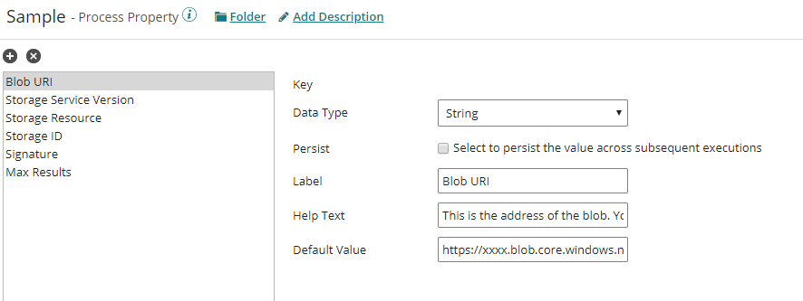
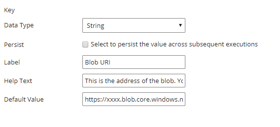
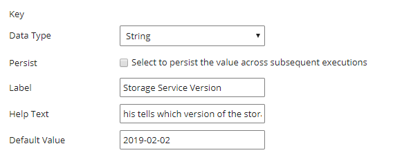
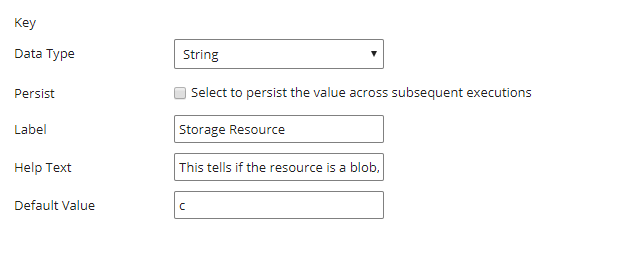
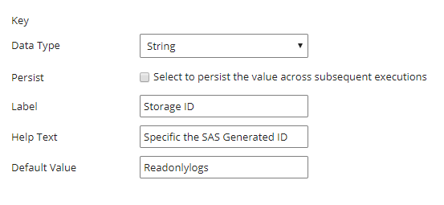
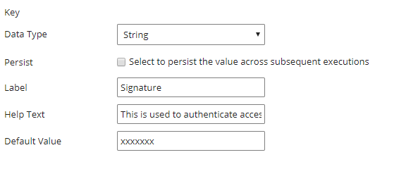
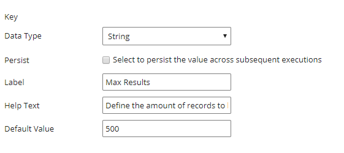
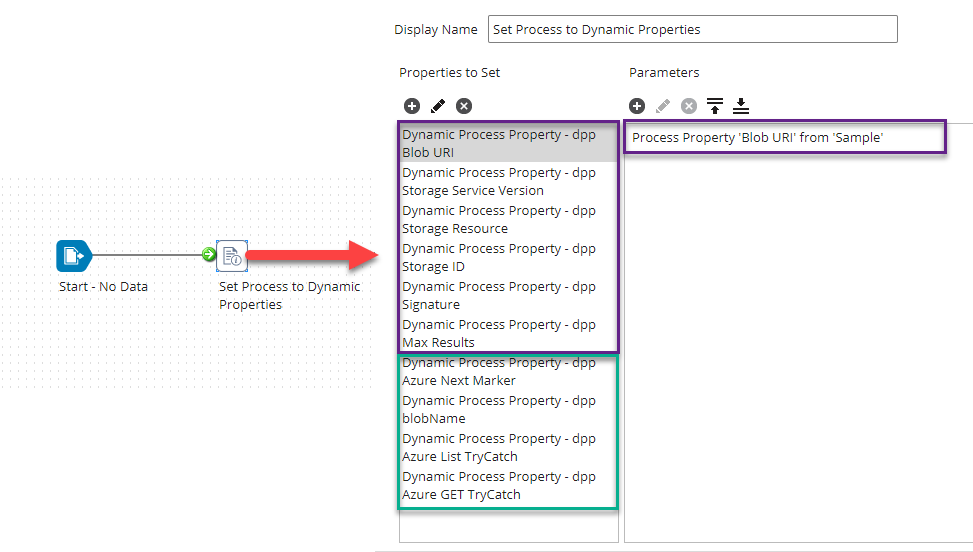
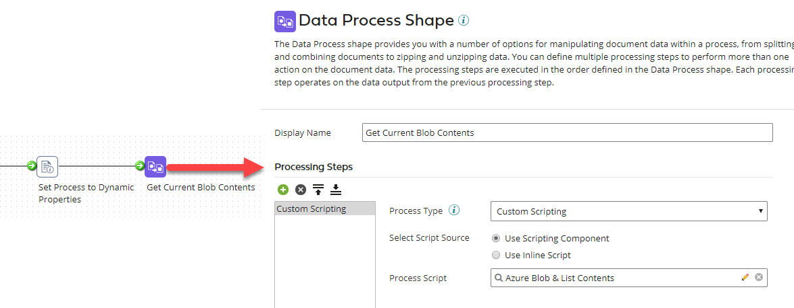
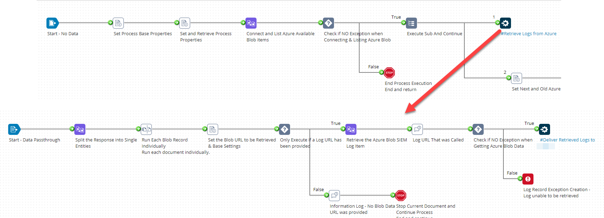

 

  

  <h3 align="center">Azure Blob Connector</h3>

  

    A predefined component for use with the Boomi Platform and Azure Blob Storage!

  

<!-- TABLE OF CONTENTS -->
## Table of Contents

- [Table of Contents](#table-of-contents)
- [About The Connector](#about-the-connector)
  - [Built With](#built-with)
- [Getting Started](#getting-started)
  - [Prerequisites](#prerequisites)
  - [Installation](#installation)
- [Usage](#usage)
  - [Create & Set Process Property](#create--set-process-property)
  - [Create & Set Dynamic Process Property](#create--set-dynamic-process-property)
  - [Using it](#using-it)
- [Contributing](#contributing)
- [License](#license)
- [Contact](#contact)
- [Acknowledgements](#acknowledgements)

## About The Connector

The connector operations used are via Groovy (Custom Scripting), while Boomi provides a pre-built connector using the SDK it does not provide the listing operation at present - though this can be executed via the HTTP connector this will of course cost an additional license.

The current options provided by this are:
* List
* Get

_Other options will be added i.e. Send in time or can be submitted by you using one of the existing List / Get as a base._

### Built With

* [Groovy](https://groovy-lang.org/) - Default Boomi Provided Versions

## Getting Started

This is an example of how you may give instructions on setting up your project locally.
To get a local copy up and running follow these simple example steps.

### Prerequisites

* No additional library / jars are required.

* The use of both Process Property Components and Dynamic Process Property Setup is required.

### Installation

1. Download and Uzip Repo to Local location
2. Select the required action folder
3. Download the provided Groovy Script
4. Logon to the [Boomi Platform](https://platform.boomi.com)
5. Change / Select Area to Integration
6. Create New Component
7. Select Scripting
8. Enter In Description and Location
9. Set Type to Process Script
10. Copy and Paste the Script Downloaded into the Newly Created Script
11. Save.

## Usage

The following outlines the recommended setup for use of the connector scripts to enable the script to remain as is and use the Process Property Component to set the main data for easy maintenance.

It may seem like a lot in the document but really its not; once you have done it once you have a template forever **and don't worry the following outlines each step**

### Create & Set Process Property

1. Create a New Process Property Component in your Project
2. Create the following Process Items as String and assign the required Value.

   1.  Blob URI
       1.  This is the address of the blob. You should always use HTTPS to construct a shared access signature. Example: https://myaccount.blob.core.windows.net/sascontainer/sasblob.txt Note that even if you use a stored access policy on a container to create the SAS for a blob, this is the address of the blob, not the container.
       *  
   2.  Storage Service Version
       1. This tells which version of the storage services to use. Example: sv=2014-02-14 This is optional, and will be set to the newest version available if not specified.
       *  
   3.  Storage Resource
       1.  This tells if the resource is a blob, queue, etc. Example: sr=b, which says the resource is a blob, or sr=c, which says the resource is a container.
       *  
   4.  Storage ID
       1.  Specific the SAS Generated ID
       *  
   5.  Signature
       1.  This is used to authenticate access to the blob.
       *  
   6.  Max Results
       1.  Define the amount of records to be returned per service call
       *  

### Create & Set Dynamic Process Property

1. Within your flow add in a Set Properties Shape
2. Create the following Dynamic Process Properties - using the the Process Property created value as the parameters.
   1. dpp Blob URI
   2. dpp Storage Service Version
   3. dpp Storage Resource
   4. dpp Storage ID
   5. dpp Signature
   6. dpp Max Results
3. Create the following Dynamic Process Properties with either no Parameters or use a Static Blank Value
   1. dpp Azure Next Marker
   2. dpp blobName
   3. dpp Azure List TryCatch
   4. dpp Azure GET TryCatch

### Using it

1. Within your flow add in a Data Process Shape
2. Select Custom Scripting
3. Set Use Scripting Component
4. Select the required Process Script

**Note:** Use Decision Shape after Data Process Shape to check the TryCatch process property as Boomis TryCatch Shape does not work with Custom Scripting.

If you are listing the above is only the fist step; you will need to then split the results to go and retrieve the blob info you want. As to the best way this depends but the following provides a visual reference of how it has been done.

**When Sharing of Process Flows is available a template will be provided**

## Contributing

Contributions are what make the open source community such an amazing place to be learn, inspire, and create. Any contributions you make are **greatly appreciated**.

1. Fork the Project
2. Create your Feature Branch (`git checkout -b feature/AmazingFeature`)
3. Commit your Changes (`git commit -m 'Add some AmazingFeature'`)
4. Push to the Branch (`git push origin feature/AmazingFeature`)
5. Open a Pull Request

## License

Distributed under the MIT License. See `LICENSE` for more information.

## Contact

Name - [Mitchell Franklin](https://mitchellfranklin.info) - mitchellfranklin@gmail.com

<!-- ACKNOWLEDGEMENTS -->
## Acknowledgements
* [Boomi](https://boomi.com/)
* [Boomi Community](https://community.boomi.com/)
* [Apache Groovy](https://groovy-lang.org)
* [Choose an Open Source License](https://choosealicense.com)
* [Visual Studio Code](https://code.visualstudio.com/)